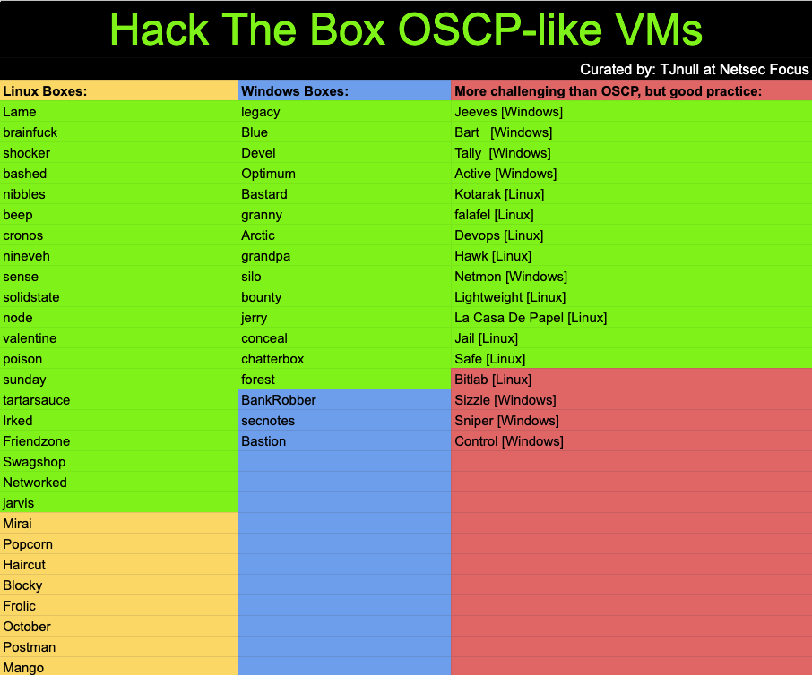

# Introduction

I am currently studying for the OSCP and will be largely focused on TJnull's list of OSCP-like boxes as shown below. I'll be attempting to write in-depth walkthroughs on each box while explaining the process of exploiting it as well as why some methods do not work. This is to confirm my understanding of the concepts that I have come across. 

                                      [**TJ\_Null's list of Hack The Box OSCP-like VMs**]
                                      (https://docs.google.com/spreadsheets/u/1/d/1dwSMIAPIam0PuRBkCiDI88pU3yzrqqHkDtBngUHNCw8/htmlview#)

