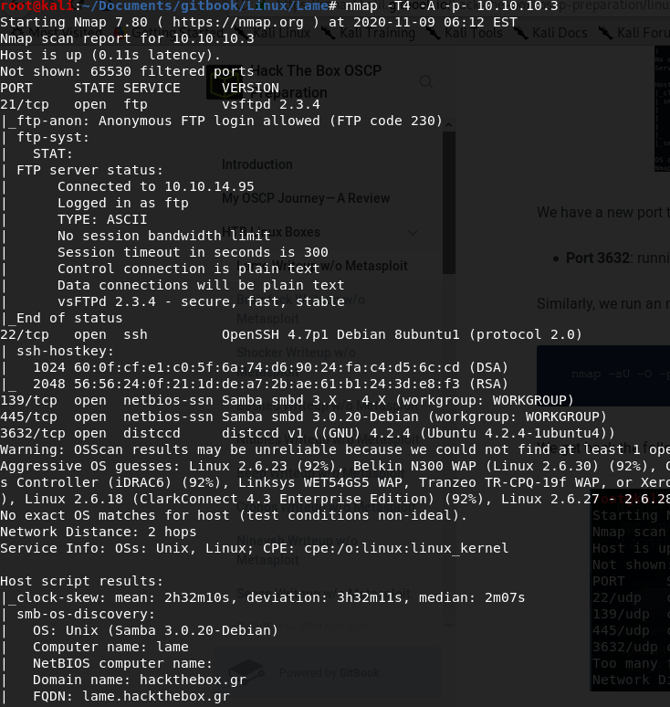
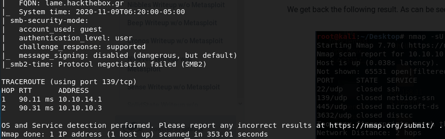
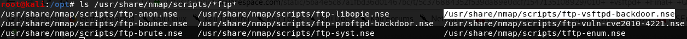
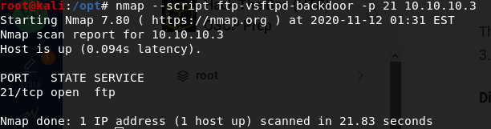
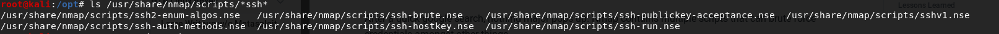
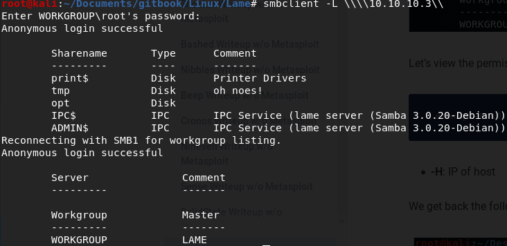
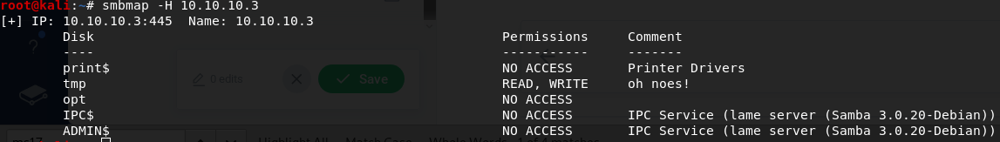
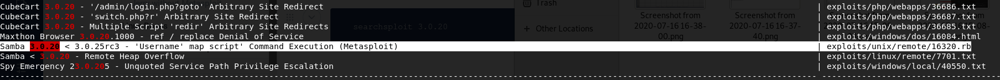
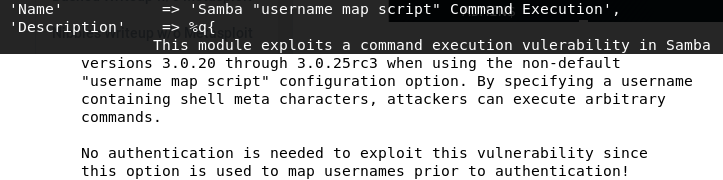

# Lame without Metasploit

## Enumeration

### Run nmap scan: 

#### **`nmap -T4 -A -p- 10.10.10.3`**

* -T4 flag is to speed the scan up a bit. T3 is the default if this is not specified.
* -A flag will enable Operating system, version detection, script scanning, and traceroute.
* -p- flag will scan for all 65,535 ports. By default, if this is not specified, nmap will scan the top 1000 ports.





The aggressive OS scan results were cropped out as the Host script results came back with Unix Samba 3.0.20-Debian.

#### Dissecting the Results:

* **Port 21:** Running FTP version 2.3.4 and it allows anonymous login.
* **Port 22:** Running OpenSSH version 4.7p1.
* **Ports 139 and 445:** Running Samba version 3.0.20-Debian.
* **Port 3632:** Running the distributed compiler daemon distcc version 1.

### Port 21 vsftpd 2.3.4

Wikipedia states "[In July 2011, it was discovered that vsftpd version 2.3.4 downloadable from the master site had been compromised.](https://en.wikipedia.org/wiki/Vsftpd)[\[2\]](https://en.wikipedia.org/wiki/Vsftpd#cite_note-2)[\[3\]](https://en.wikipedia.org/wiki/Vsftpd#cite_note-sbs1-3) [Users logging into a compromised vsftpd-2.3.4 server may issue a ":\)" smileyface as the username and gain a command shell on port 6200.](https://en.wikipedia.org/wiki/Vsftpd)[\[3\]](https://en.wikipedia.org/wiki/Vsftpd#cite_note-sbs1-3) [This was not an issue of a security hole in vsftpd, instead, an unknown attacker had uploaded a different version of vsftpd which contained a](https://en.wikipedia.org/wiki/Vsftpd) [backdoor](https://en.wikipedia.org/wiki/Backdoor_%28computing%29)."

Let's enumerate FTP and see if we have a script we can run against it:



Let's execute the script:

```text
nmap --script ftp-vsftpd-backdoor -p 21 10.10.10.3
```



We find it is not vulnerable to the backdoor vulnerability so we will move on to enumerating port 22.

### Port 22 OpenSSH 4.7p1

Searching Google brings up nothing of great importance, so we will try to see what nmap scripts we have available to us to potentially try.



We can try to run these scripts, but since they consist of brute forcing, this can take quite a bit of time and may not even be worth it. SSH tends to not be exploitable most of the time, so we will not consider this a "low hanging fruit" and move on to our next option.

### Ports 139 and 445 Samba version 3.0.20-Debian

These ports being open should set off an alarm, as it tends to be exploitable most of the time and allows one to gain a foothold.

Let's use smbclient to see if we can connect to the SMB server.

```text
smbclient -L \\\\10.10.10.3\\
```

* **-L flag:** Lists services available on the server.



Great, anonymous login is allowed and we can access the SMB server. Let's see what permissions are on the share drives with smbmap.

Install smbmap with:

```text
apt-get install smbmap
```

Then run smbmap:

```text
smbmap -H 10.10.10.3
```

* **-H flag:** IP of the host we are checking permissions on.



We discover we have READ/WRITE permissions in the tmp share.

Let's use searchsploit to see if there are any potential exploits we can use for Samba version 3.0.20.

```text
searchsploit 3.0.20
```

We discover two possible exploits, with one being from Metasploit:



Let's check the contents for any helpful information:

```text
searchsploit -x 16320.rb
```



We discover if we enter a username containing shell meta characters, we could execute arbitrary commands. Scrolling further down, we see the following line of code:

```text
username = "/=`nohup " + payload.encoded + "`"
```

This line of code includes shell meta characters, and indicates our reverse shell should be where payload.encoded is.

We have one possible exploit we can try, but first, let's finish enumerating our open services.

### Port 3632 distcc v1

First, let's find any potential nmap scripts we could run against this service:

```text
ls /usr/share/nmap/scripts/*distcc*
```

And we only receive one script we can try: _**/usr/share/nmap/scripts/distcc-cve2004-2687.nse**_

```text
nmap -v -p 3632 -script distcc-cve2004-2687.nse
```

