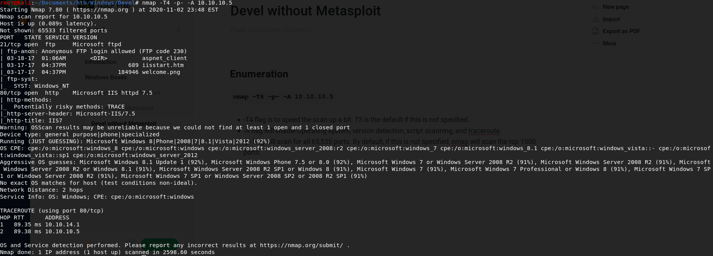

# Devel without Metasploit

## Enumeration

#### **`nmap -T4 -p- -A 10.10.10.5`**

* -T4 flag is to speed the scan up a bit. T3 is the default if this is not specified.
* -A flag will enable Operating system, version detection, script scanning, and traceroute.
* -p- flag will scan for all 65,535 ports. By default, if this is not specified, nmap will scan the top 1000 ports.

#### Dissecting the Results:

